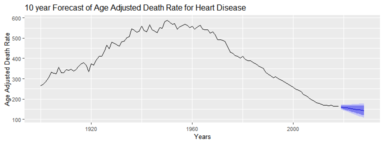

## Motivation

Mortality statistics are an important metric for assessing the overall trends in 

- Quality of life 
- Advancements in medicine that improve life expectancy over time.

Important policy decisions can be made to allocate future funds and resources or establish new thrust areas of research for the advancement of healthcare based on this data.

This app makes predictions on future trends in mortality due to selected causes.

## Data Source and structure

This [dataset](https://healthdata.gov/dataset/nchs-age-adjusted-death-rates-selected-major-causes-death) has U.S. mortality since 1900. The dataset has three fields (1) Year (2) Cause ( one of Accidents, Cancer, Heart Disease, Influenza and Pneumonia, and Stroke) (3) Age adjusted Death Rate ([AADR](https://www.nlm.nih.gov/nichsr/stats_tutorial/section2/mod5_age.html)).


```r
data <- read.csv("Data/NCHS_-_AADR_Major_Causes_of_Death.csv")
knitr::kable(head(data,3))
```


| Year|Cause         | Age.Adjusted.Death.Rate|
|----:|:-------------|-----------------------:|
| 1900|Heart Disease |                   265.4|
| 1901|Heart Disease |                   272.6|
| 1902|Heart Disease |                   285.2|

## Overall App Layout
The App consists of a side panel and a main panel. 
The side panel has two inputs - 

- A drop down list to select the cause of death for which you would like to forecast death rates.
- A slider to select the number of years into the future that you would like to project death rates

The main panel has two plot areas. 

- The upper area presents a plot of all the data.
- The lower area presents a forecast plot reactively.

## How to use the app
On the side panel, 

- Select a cause of death and a forecast time window.
- Click on "Update forecast" to generate a forecast plot based on your selections of Cause and forecast time window.

<!-- -->
